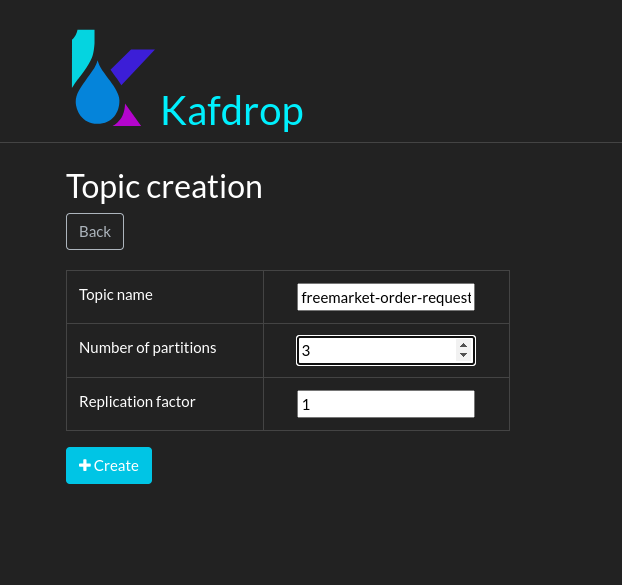
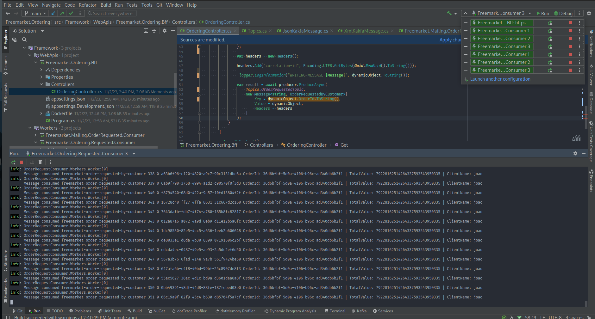

# Kafka implementation poc

This is a simple project POC to use Kafka to send and consume messages using a simple use case of a marketplace ordering system.

there we have 3 projects:
- one BFF to get request from Client, 
- one Worker to consume the order requested from client and save in the base (is fake, have only a threadSleep to simulate database operations)
- one Worker to consume the order requested from client and send a email to customer to confirmating order requested (is fake, have only a threadSleep to simulate smtp connection)

## steps to run projects:

### 1 - run `docker compose up` on root from project

### 2 - access localhost: http://localhost:19000 and create a new topic `freemarket-order-requested-by-customer` with 3 partitions: 

### 3 - run the project Freemarket.Ordering.Bff and run route from swagger `https://localhost:7181/swagger/index.html` to produce messages on topic

### 4 - run 3 instances from Freemarket.Ordering.Requested.Consumer to consume messages from topic with partitions rebalacing

### 5 - run 1 instance from Freemarket.Mailing.OrderRequested.Consumer to consume messages from topic to 'send mail' about order

Image of 6 consumers consuming 100K messages with parallel consume

obs: remembering that project is a Poc and is not ready to production environment!! and dont have best practices 

libs: [Confluent](https://docs.confluent.io/kafka-clients/dotnet/current/overview.html)

author: paulino.joaovitor@yahoo.com.br